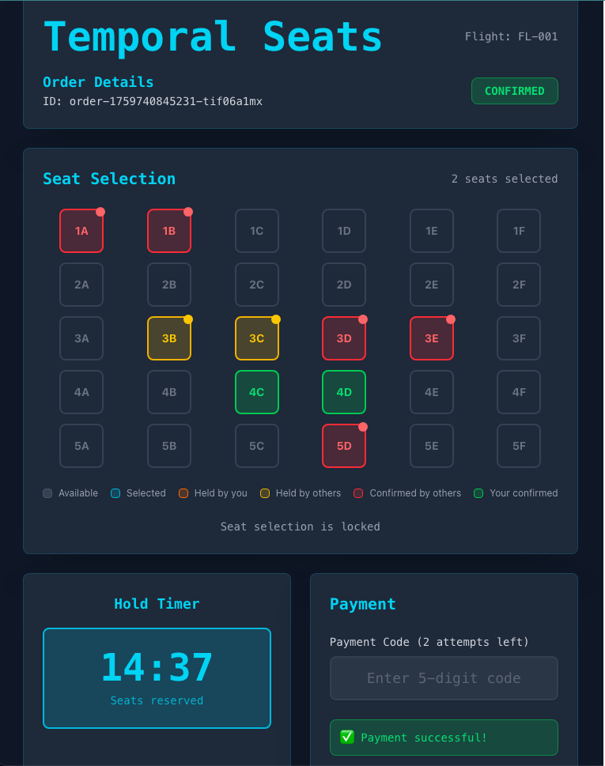

# Temporal Seats (Home Assignment)

A flight seat reservation system with real-time updates, built with **Temporal** (Go SDK).

## What it does
- Create orders, select seats, get **15-minute hold** with countdown
- Payment simulation with **5-digit code**, **3 retries**, **15% fail rate**
- Real-time updates via **SSE** (no polling)

---

## 🖼️ User Interface

The application features a modern, dark-themed UI for seat selection and payment processing:



**Screenshot shows the system in action:**
- **Red seats**: Confirmed by other users (permanently booked)
- **Yellow seats**: Currently held by other users (temporary reservations)
- **Green seats**: Successfully confirmed by you
- **Gray seats**: Available for selection
- **Live countdown**: Shows remaining hold time (15 minutes)
- **Dynamic updates**: Seat states change in real-time as other users make reservations

---

## 🚀 Quick Start

```bash
# Start everything
make up && make run

# Open UI
cd ui && npm install && npm run dev
```

**Access Points:**
- **UI**: http://localhost:5173
- **API**: http://localhost:8080  
- **Temporal UI**: http://localhost:8088

---

## 📡 API Demo

```bash
# Create order → Select seats → Pay
curl -XPOST localhost:8080/orders -d '{"flightID":"F-100","orderID":"o-1"}'
curl -XPOST localhost:8080/orders/o-1/seats -d '{"seats":["1A","1B"]}'
curl -XPOST localhost:8080/orders/o-1/payment -d '{"code":"12345"}'

# Watch real-time updates
curl -N localhost:8080/orders/o-1/events
```

**Response (streaming):**
```
data: {"State":"SEATS_SELECTED","Seats":["1A","1B"],"HoldExpiresAt":"2025-10-04T18:45:00Z","AttemptsLeft":3}
data: {"State":"CONFIRMED","Seats":["1A","1B"],"HoldExpiresAt":"2025-10-04T18:45:00Z","AttemptsLeft":3}
```

---

## 🏗️ Architecture

```
Frontend (React) → API Server → Temporal Server
     ↓                ↓              ↓
  SSE Updates    Workflows      PostgreSQL
```

**Key Patterns:**
- **Entity Workflows**: Each seat has its own workflow (`seat::{flightID}::{seatID}`)
- **Saga Pattern**: Order workflow orchestrates seat holds + payment
- **Event Sourcing**: SSE streams state changes to UI
- **Retry Logic**: Built-in Temporal retries for payment failures

**Order States:** `PENDING` → `SEATS_SELECTED` → `CONFIRMED`/`FAILED`/`EXPIRED`

---

## 🧪 Testing

```bash
make test-all    # Go + UI tests
make test-e2e    # Full integration
make ci          # Full CI check
```

**Test Coverage:**
- **Backend**: 15+ unit tests (workflows, activities, handlers)
- **Frontend**: Component tests (SeatGrid, PaymentForm, Countdown)
- **E2E**: Full system integration with Temporal, API, Worker, and SSE

---

## 📂 Project Structure

```
temporal-seats/
├── cmd/          # API server + Worker entry points
├── internal/     # Workflows, activities, HTTP handlers
├── ui/           # React frontend with Vite
├── test/         # Unit, integration, and E2E tests
├── infra/        # Docker Compose setup
└── docs/         # Documentation and screenshots
```

---

## 🛠️ Technical Details

### Workflows

**OrderOrchestrationWorkflow**
- **ID**: `order::{orderID}`
- **Signals**: `UpdateSeats`, `SubmitPayment`
- **Query**: `GetStatus` (used by SSE)

**SeatEntityWorkflow**
- **ID**: `seat::{flightID}::{seatID}`
- **Purpose**: Serialize seat operations, prevent double-booking
- **Commands**: `HOLD`, `EXTEND`, `RELEASE`

### Activities

**ValidatePaymentActivity**
- **Timeout**: 10 seconds
- **Retry Policy**: 3 attempts with exponential backoff
- **Behavior**: 15% random failure rate

### Task Queues
- `order-tq`: Order orchestration workflows and payment activities
- `seat-tq`: Seat entity workflows

---

## 📝 Design Decisions

1. **No Database**: Temporal Entity Workflows store seat state
2. **SSE over WebSocket**: Simpler, HTTP-native, auto-reconnect
3. **Per-seat Workflows**: Better concurrency, no locking needed
4. **Saga Pattern**: Order workflow coordinates all operations
5. **Retry Policies**: Built-in Temporal retries for payment flakiness

---

## Production Considerations

For production deployment, consider:
- **Database**: Add persistent storage for audit logs
- **Authentication**: Add JWT/OAuth for API security
- **Rate Limiting**: Protect API endpoints
- **Monitoring**: Add metrics (Prometheus) and tracing (Jaeger)
- **Horizontal Scaling**: Multiple workers for high throughput
- **Circuit Breakers**: Protect against cascading failures

---

## 📄 License

This is a home assignment project for demonstration purposes.
